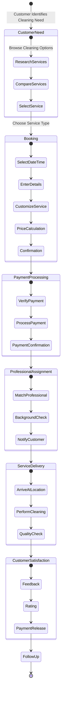

# Kathy Clean
> It's the cleaner service by default by the easy way to request a cleaning and get someone ready 

## Flow
### Customer 
Login/Signup -> jobs ->   

```mermaid
stateDiagram-v2
    [*] --> CustomerNeed: Customer Identifies Cleaning Need
    
    state CustomerNeed {
        [*] --> ResearchServices: Browse Cleaning Options
        ResearchServices --> CompareServices
        CompareServices --> SelectService
    }
    
    SelectService --> Booking : Choose Service Type
    
    state Booking {
        [*] --> SelectDateTime
        SelectDateTime --> EnterDetails
        EnterDetails --> CustomizeService
        CustomizeService --> PriceCalculation
        PriceCalculation --> Confirmation
    }
    
    Confirmation --> PaymentProcessing
    
    state PaymentProcessing {
        [*] --> VerifyPayment
        VerifyPayment --> ProcessPayment
        ProcessPayment --> PaymentConfirmation
    }
    
    PaymentConfirmation --> ProfessionalAssignment
    
    state ProfessionalAssignment {
        [*] --> MatchProfessional
        MatchProfessional --> BackgroundCheck
        BackgroundCheck --> NotifyCustomer
    }
    
    NotifyCustomer --> ServiceDelivery
    
    state ServiceDelivery {
        [*] --> ArriveAtLocation
        ArriveAtLocation --> PerformCleaning
        PerformCleaning --> QualityCheck
    }
    
    QualityCheck --> CustomerSatisfaction
    
    state CustomerSatisfaction {
        [*] --> Feedback
        Feedback --> Rating
        Rating --> PaymentRelease
    }
    
    PaymentRelease --> FollowUp
    FollowUp --> [*]
```

requests 

### Employee
